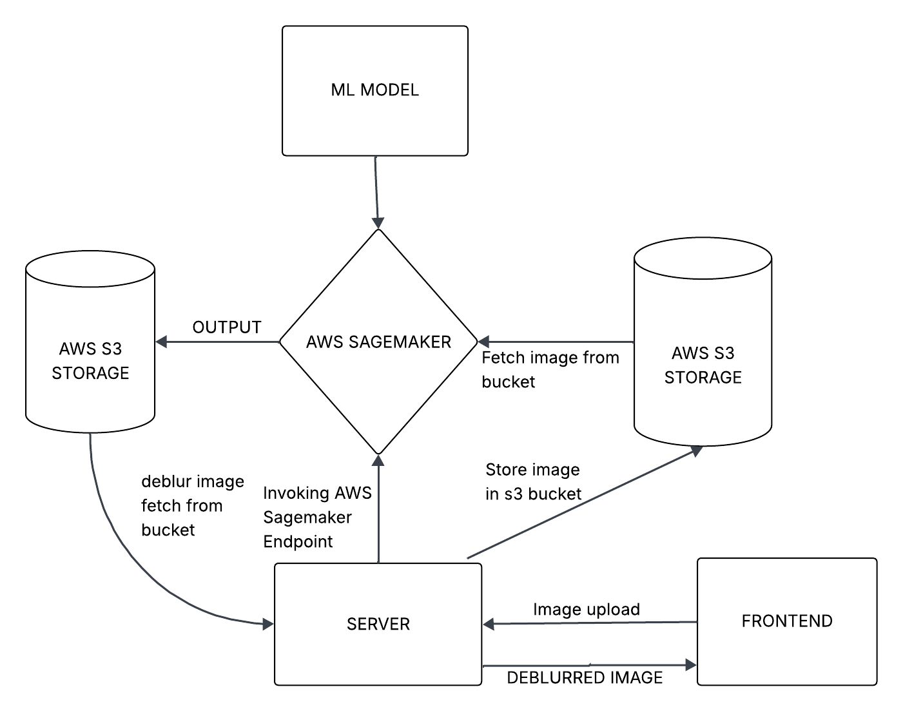

# DEBLUR

- The repo contains two folder model and app.
- The model folder contains the ML model that takes the blurred image as input and deblurs the image.
- The app folder houses the frontend and backend code of the mobile app.

# MODEL

## Overview
This project implements an image deblurring model based on the U-Net architecture.  
The model learns to restore sharp images from blurred inputs using supervised deep learning.

## How It Works
- The task is treated as an image-to-image translation problem.
- A U-Net convolutional neural network is used.
- The encoder extracts features from blurred images.
- The decoder reconstructs a sharp image using upsampling and skip connections.
- The model is trained on paired blurred and sharp images.

## Applications
- Image restoration
- Photography enhancement
- Medical and satellite imaging

## Requirements
- Python
- PyTorch or TensorFlow
- NumPy, OpenCV

# APP

## FRONTEND
- The frontend is created using Flutter.
- It has features for login, signup, and uploading an image.
- The frontend sends the picture to the backend Express server for further processing.

## BACKEND
- The backend is implemented in Node.js.
- AWS Sagemaker is used to host the Machine Learning Model which makes use of AWS S3 storage to store and process images.
- The output image is stored in the S3 bucket which is then fetched by the Server and sends it to the frontend mobile app.
- AWS Cognito is used for authenticating the user.

# ARCHITECTURE

# SETUP

- clone the repo using 'git clone'
- inside the app there are 2 folders containing the frontend and backend code.
- Inside the frontend folder install the flutter dependencies with the 'flutter pub get' command.
- Inside the backend folder install the backend dependencies with 'npm install' command.
- To run the machine learning model locally in your system, packages like torch, torchvision, Pillow and boto3 has to be installed.

# HOW TO RUN

- start the flutter frontend with the 'flutter run' command (Note: android emulator or Physical device should be connected to the system)
- start the backend server using 'node index.js' command. (Note: AWS SDK has to be installed and configured in the local system)
  
